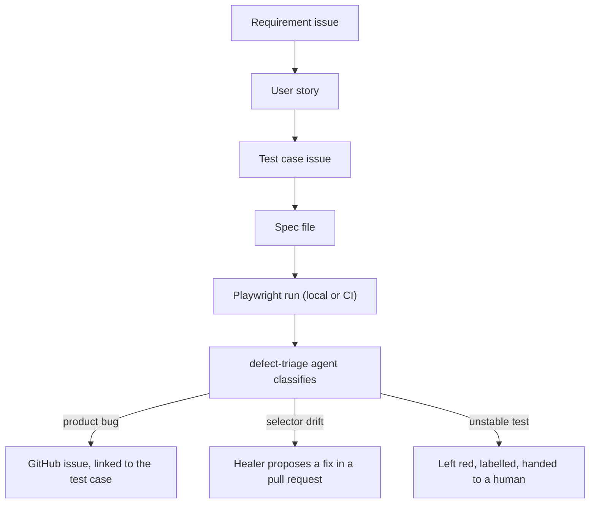

# qa-agentic-lab

A QA automation project that tests [saucedemo.com](https://www.saucedemo.com/) with
Playwright, and uses Claude Code agents to triage the failures and propose fixes.

It is a working portfolio: the requirements, stories, test cases and bugs all live
in this repository's issues, so the process is as visible as the code.

## Why saucedemo

It ships deliberate defects behind specific accounts, `problem_user`,
`performance_glitch_user`, `error_user` and `visual_user`. That gives the
defect-finding agents real, reproducible material instead of contrived failures.

## How it fits together



Each test carries its test case ID as a tag, so a failure names its own issue:

```ts
test('locked out user is refused', { tag: '@TC-LOGIN-002' }, async ({ loginPage }) => { … });
```

## Credentials

The saucedemo passwords are printed on the site's own login page. They are still
handled as secrets here: read from `.env` at runtime, listed as placeholders in
`.env.example`, stored as GitHub secrets in CI, and scanned for by gitleaks on
every push. The habit is the point.

## Running the tests

```bash
npm ci
npx playwright install chromium
cp .env.example .env   # then fill it in
npm test               # npm run test:ui for the interactive runner
npm run report         # opens the HTML report of the last run
```

## Layout

| Path                                 | What lives there                                         |
| ------------------------------------ | -------------------------------------------------------- |
| [`src/pages/`](src/pages/)           | Page objects: where the elements are, what a user can do |
| [`src/fixtures/`](src/fixtures/)     | Custom fixtures that hand page objects to a test         |
| [`src/data/`](src/data/)             | Environment reading and the test accounts                |
| [`tests/e2e/`](tests/e2e/)           | The specs                                                |
| [`.claude/agents/`](.claude/agents/) | Agent definitions, committed so they can be read         |
| [`docs/adr/`](docs/adr/)             | Decisions, with the reasoning that produced them         |

## Status

Phase 1: login covered end to end, triage agent running locally.
Phase 2 adds inventory, cart and checkout, plus the intentional-defect suite.

See [the plan](docs/plan.md) for the full roadmap.
